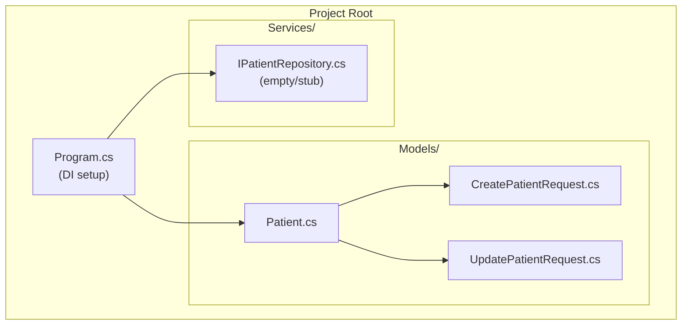
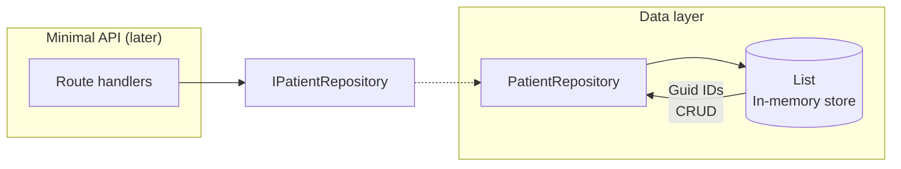
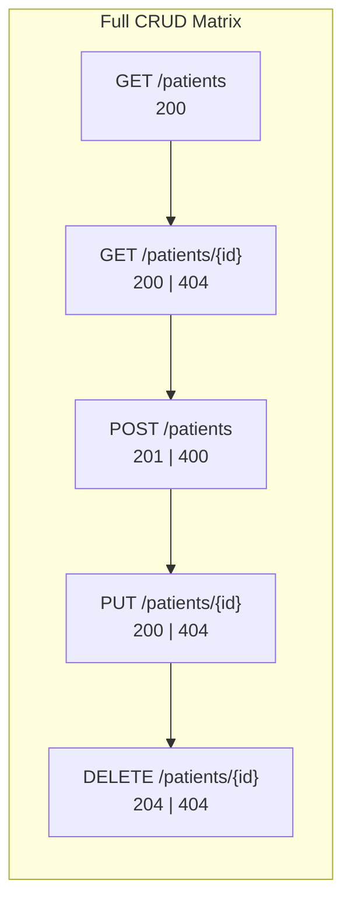
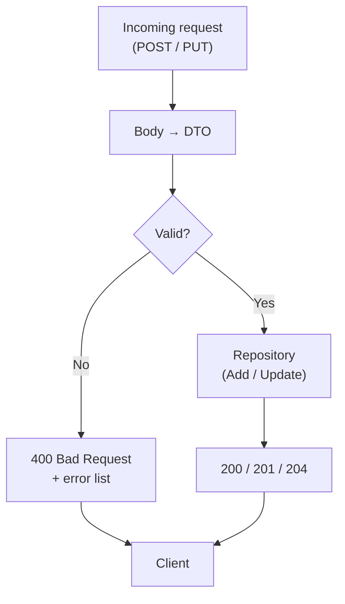
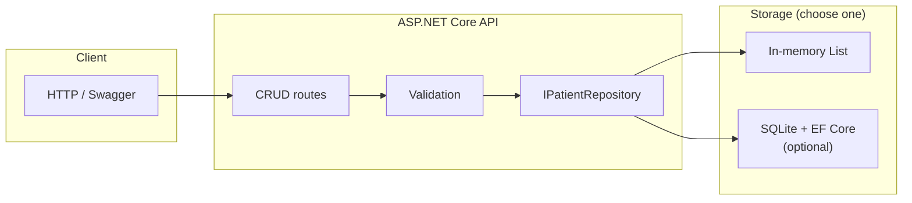

# Hospital Management – 5-Phase Development Plan

A visual, phase-by-phase guide for building the Hospital Management .NET CRUD API. Each phase has clear objectives, deliverables, and a **visual outcome** showing what you’ll have at the end.

---

## Phase 1: Foundation & Project Structure

**Time:** ~2 h

### Objectives

- Set up folder structure (Models, Services).
- Define the **Patient** entity and DTOs (`CreatePatientRequest`, `UpdatePatientRequest`).
- Register types in dependency injection (Program.cs).

### Deliverables

- `Models/Patient.cs` — Id, FullName, DateOfBirth, Gender, PhoneNumber, Email, AdmittedAt?, IsDischarged.
- `Models/CreatePatientRequest.cs`, `Models/UpdatePatientRequest.cs`.
- `Program.cs` — `builder.Services.AddScoped<IPatientRepository, PatientRepository>()` (interface prepared for Phase 2).

### Visual outcome



**At the end of Phase 1:** You have a runnable app with models and DI wiring; no endpoints yet.

---

## Phase 2: Data Layer – In-Memory Repository

**Time:** ~2 h

### Objectives

- Implement **IPatientRepository** with GetAll, GetById, Add, Update, Delete.
- Implement **PatientRepository** using a `List<Patient>` and generated IDs (e.g. `Guid`).
- No database; focus on in-memory CRUD logic.

### Deliverables

- `Services/IPatientRepository.cs` — interface with all five operations.
- `Services/PatientRepository.cs` — in-memory implementation.
- `Program.cs` — register `PatientRepository` (if not done in Phase 1).

### Visual outcome



**At the end of Phase 2:** All CRUD logic lives in the repository; you can unit-test it or call it from placeholders.

---

## Phase 3: Read & Create (GET & POST)

**Time:** ~2 h

### Objectives

- Expose **GET /patients** (list all) and **GET /patients/{id}** (single patient).
- Expose **POST /patients** with JSON body binding to `CreatePatientRequest`.
- Return correct status codes: 200, 201, 404.

### Deliverables

- `GET /patients` → 200 + list of patients.
- `GET /patients/{id}` → 200 + patient or 404.
- `POST /patients` → 201 + created patient (with Id), or 400 if binding fails.

### Visual outcome

```mermaid
sequenceDiagram
  participant Client
  participant API as Minimal API
  participant Repo as PatientRepository

  Client->>+API: GET /patients
  API->>+Repo: GetAll()
  Repo-->>-API: List<Patient>
  API-->>-Client: 200 JSON

  Client->>+API: GET /patients/{id}
  API->>+Repo: GetById(id)
  Repo-->>-API: Patient or null
  alt Found
    API-->>-Client: 200 JSON
  else Not found
    API-->>-Client: 404
  end

  Client->>+API: POST /patients (JSON body)
  API->>API: Bind CreatePatientRequest
  API->>+Repo: Add(patient)
  Repo-->>-API: Patient (with Id)
  API-->>-Client: 201 + Location
```

**At the end of Phase 3:** You can list patients, get one by id, and create new patients via Swagger or .http file.

---

## Phase 4: Update & Delete (PUT & DELETE)

**Time:** ~2 h

### Objectives

- Expose **PUT /patients/{id}** with body binding to `UpdatePatientRequest`; return 200 or 404.
- Expose **DELETE /patients/{id}**; return 204 (success) or 404.
- Complete the full CRUD surface.

### Deliverables

- `PUT /patients/{id}` → 200 + updated patient, or 404 if not found.
- `DELETE /patients/{id}` → 204 No Content, or 404.

### Visual outcome



**Endpoint summary:**

| Method | Path           | Success | Not found / Invalid |
| ------ | -------------- | ------- | ------------------- |
| GET    | /patients      | 200     | —                   |
| GET    | /patients/{id} | 200     | 404                 |
| POST   | /patients      | 201     | 400                 |
| PUT    | /patients/{id} | 200     | 404                 |
| DELETE | /patients/{id} | 204     | 404                 |

**At the end of Phase 4:** Full CRUD is implemented and testable via Swagger or `hospital_management.http`.

---

## Phase 5: Validation & Polish

**Time:** ~2 h

### Objectives

- Add validation: required fields, email format, phone format.
- Return **400 Bad Request** with clear error messages when validation fails.
- Optional: add SQLite + Entity Framework Core and a DB-backed repository (if time allows).

### Deliverables

- Validation on `CreatePatientRequest` and `UpdatePatientRequest` (e.g. DataAnnotations or FluentValidation).
- Consistent 400 responses with validation errors in the body.
- Optional: EF Core, DbContext, migration, and a `PatientDbContextRepository` swapping in for the in-memory one.

### Visual outcome



**Final architecture (with optional DB):**



**At the end of Phase 5:** Production-ready CRUD API with validation; optionally persistent storage via SQLite + EF Core.

---

## Summary

| Phase | Focus                          | Main visual                          |
| ----- | ------------------------------ | ------------------------------------ |
| 1     | Foundation & project structure | Project tree + DI                    |
| 2     | In-memory repository           | Data layer + store                   |
| 3     | GET & POST                     | Sequence diagram (Read + Create)     |
| 4     | PUT & DELETE                   | CRUD matrix + status codes           |
| 5     | Validation & polish            | Validation flow + final architecture |

**Total:** ~10 h. Phases 1–4 give full CRUD; Phase 5 adds validation and optional persistence.
