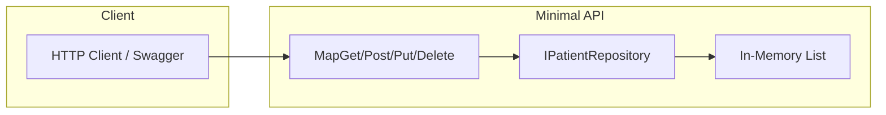

# Hospital Management – .NET CRUD API

A minimal ASP.NET Core API for practising CRUD operations on a **Patients** entity. This project is a 10-hour learning path for developers (e.g. from Flutter) who want to get hands-on with .NET and REST APIs.

## Overview

- **Stack:** ASP.NET Core Minimal API (.NET 10), in-memory storage (optional SQLite + EF Core later).
- **Entity:** Patients — full Create, Read, Update, Delete via REST.
- **Goal:** Learn .NET CRUD patterns without scope creep.

## Prerequisites

- [.NET 10 SDK](https://dotnet.microsoft.com/download)
- IDE: VS Code, Visual Studio, or Rider

## Run the project

```bash
dotnet run
```

- API: `https://localhost:5245` (or the port in `Properties/launchSettings.json`)
- OpenAPI (Swagger): `https://localhost:5245/openapi/v1.json` (when running in Development)
- Use `hospital_management.http` or any REST client to call the endpoints

## Project scope

### In scope

- **One main entity: Patients** — Id, FullName, DateOfBirth, Gender, PhoneNumber, Email, AdmittedAt (optional), IsDischarged. Full CRUD via REST API.
- **Endpoints:** `GET /patients`, `GET /patients/{id}`, `POST /patients`, `PUT /patients/{id}`, `DELETE /patients/{id}`.
- **In-memory storage** (e.g. `List<Patient>`) so you focus on API and C#. Optionally add SQLite + Entity Framework Core later.
- **DTOs and validation** — Required fields, basic email/phone validation; return 400 with errors when invalid.
- **OpenAPI** for testing (Swagger or `hospital_management.http`).

### Out of scope (for the 10h window)

- Authentication/authorization
- Multiple entities (Doctors, Appointments, etc.)
- Flutter (or any) front-end

## Flutter → .NET mapping

| Flutter / Dart     | .NET / C#                                                              |
| ------------------ | ---------------------------------------------------------------------- |
| Model class        | C# class or record (`Patient`, DTOs)                                   |
| API client calls   | Minimal API `MapGet` / `MapPost` / `MapPut` / `MapDelete`              |
| Repository/Service | Interface + implementation (`IPatientRepository`, `PatientRepository`) |
| JSON               | Same idea; ASP.NET Core serializes automatically                       |

## Architecture



- **Program.cs** — Register `IPatientRepository` and `PatientRepository`; map the five CRUD routes.
- **Models** — `Patient` entity and `CreatePatientRequest` / `UpdatePatientRequest` DTOs.
- **Storage** — `PatientRepository` with a `List<Patient>` and generated IDs (e.g. `Guid`). No database required for the base scope.

## 10-hour timebox

| Phase                         | Time   | Focus                                                                |
| ----------------------------- | ------ | -------------------------------------------------------------------- |
| 1. Project layout and model   | ~1.5 h | Folders (Models, Services), `Patient` and DTOs, register in DI       |
| 2. In-memory repository       | ~1.5 h | `IPatientRepository`, `PatientRepository` with List and CRUD methods |
| 3. GET (Read)                 | ~1.5 h | `GET /patients`, `GET /patients/{id}`, return DTOs                   |
| 4. POST (Create)              | ~1.5 h | `POST /patients` with body binding and validation                    |
| 5. PUT (Update)               | ~1.5 h | `PUT /patients/{id}` with body binding, 404 if not found             |
| 6. DELETE                     | ~0.5 h | `DELETE /patients/{id}`, return 204 or 404                           |
| 7. Validation and polish      | ~1.5 h | Required fields, email/phone format, 400 with errors                 |
| 8. Optional: SQLite + EF Core | ~0.5 h | Only if ahead; minimal migration and DB-backed repository            |

**Total:** ~10 h. Phases 1–7 give full CRUD; phase 8 is optional.

## Key files

| File                                                        | Purpose                                                                                  |
| ----------------------------------------------------------- | ---------------------------------------------------------------------------------------- |
| `Program.cs`                                                | DI registration, five CRUD routes (200, 201, 204, 400, 404)                              |
| `Models/Patient.cs`                                         | Entity: Id, FullName, DateOfBirth, Gender, PhoneNumber, Email, AdmittedAt?, IsDischarged |
| `Models/CreatePatientRequest.cs`, `UpdatePatientRequest.cs` | DTOs for POST/PUT body binding                                                           |
| `Services/IPatientRepository.cs`                            | Interface: GetAll, GetById, Add, Update, Delete                                          |
| `Services/PatientRepository.cs`                             | In-memory implementation with `List<Patient>` and Guid/int IDs                           |
| `hospital_management.http`                                  | Example requests for each CRUD operation                                                 |

## Learning outcomes

After completing the plan you will have practised:

- Defining C# models and DTOs and using them in minimal API route handlers.
- Using dependency injection (interface + implementation in `Program.cs`).
- Implementing full CRUD with appropriate HTTP verbs and status codes (200, 201, 204, 400, 404).
- Binding JSON request bodies to DTOs and validating input.
- Testing endpoints via OpenAPI/Swagger or the .http file.

## License

Use this project freely for learning and practice.
